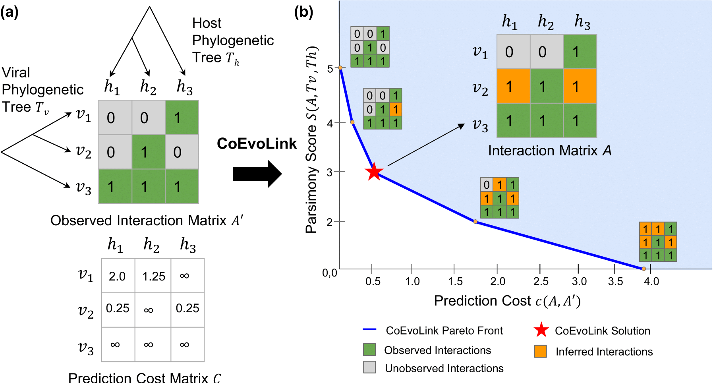

# CoEvoLink : A Cophylogenetic Approach for Viral-Host Interaction Prediction

**(a)** CoEvoLink takes an observed binary interaction matrix *A'* as input, where *a'<sub>i,j</sub>* = 1 indicates a documented virus–host interaction and *a'<sub>i,j</sub>* = 0 denotes either an untested interaction or a true non-interaction. The method infers the true interaction matrix *A* by proposing 0 → 1 flips in *A'*, guided by the viral and host phylogenies (*T<sub>v</sub>* and *T<sub>h</sub>*) and a prediction cost matrix *C*, where *c<sub>i,j</sub>* reflects the likelihood that virus *i* interacts with host *j*. **(b)** CoEvoLink balances parsimony on the phylogenies, *S(A, *T<sub>v</sub>*, *T<sub>h</sub>*)*, against the prediction cost *c(A, A')*. By computing the Pareto front over this trade-off, it selects the most plausible interaction matrix as the elbow point.


## Overview
We propose a novel framework to predict virus-host interactions that integrates sequence-based information with cophylogenetic signal by explicitly modeling their coevolutionary histories. We formulate the problem of inferring likely but currently unknown interactions between viruses and hosts while minimizing the number of evolutionary events needed to explain them, thereby yielding the most parsimonious interactions under a given coevolutionary model. Our formulation generalizes the traditional notion of maximum parsimony which is usually defined on a single phylogeny by maximizing parsimony across thehost and the virus phylogenies simultaneously. We incorporate sequence-based information by assigning a cost to each potential interaction which reflects the likelihood inferred from genomic features — higher cost indicating lower sequence-based support. Our approach yields a natural trade-off between the number of predicted interactions (or the total cost of the predictions) and parsimony score of the interactions. We derive a polynomial time algorithm to balance this trade-off by drawing connections to a maximum parsimony problem on phylogenetic networks. The resulting method, CoEvoLink, is computationally efficient, interpretable, and readily integrable with existing sequence-based approaches.

## Installation

### Prerequisites

- Python 3.8+ (tested with Python 3.8-3.12)
- Snakemake (for pipeline execution)
- RevBayes (for Bayesian phylogenetic simulations)

**Note**: This software has been primarily developed and tested with Python 3.8-3.12. While newer versions should work, they have not been extensively tested.

### Python Dependencies

The project requires the following Python packages:

```bash
pip install numpy scipy matplotlib biopython networkx pandas kneed
```

Key dependencies:
- `biopython`: Phylogenetic tree manipulation
- `networkx`: Graph algorithms and minimum cut
- `numpy`, `scipy`: Numerical computations
- `matplotlib`: Visualization
- `kneed`: Elbow detection for parameter optimization

**Note**: For reproducible installations, consider creating a virtual environment. A `requirements.txt` file may be added in future releases for version-pinned dependencies.


## Usage

### Running Simulations

#### Basic Simulation

```bash
cd my_simulations_bigger_tree
python simulation.py --seed 42 --r01_p 0.5 --r10_p 0.5 --r01_h 0.5 --r10_h 0.5 --corrupt 5000 --host_tree hosts_tree_big.newick --virus_tree viruses_tree_big.newick
```

Parameters:
- `--seed`: Random seed for reproducibility
- `--host_tree`: Newick format host phylogenetic tree
- `--virus_tree`: Newick format virus/parasite phylogenetic tree
- `--corrupt`: Number of interactions to randomly hide
- `--r01_p`, `--r10_p`: Transition rates (0→1, 1→0) for parasites
- `--r01_h`, `--r10_h`: Transition rates for hosts

#### Using Snakemake Pipeline

Run the complete analysis pipeline:

```bash
snakemake --cores all
```

This will:
1. Generate simulated host-parasite networks
2. Corrupt interaction matrices
3. Recover interactions using the network cut algorithm
4. Evaluate performance metrics (precision, recall, F1)
5. Generate visualization plots
